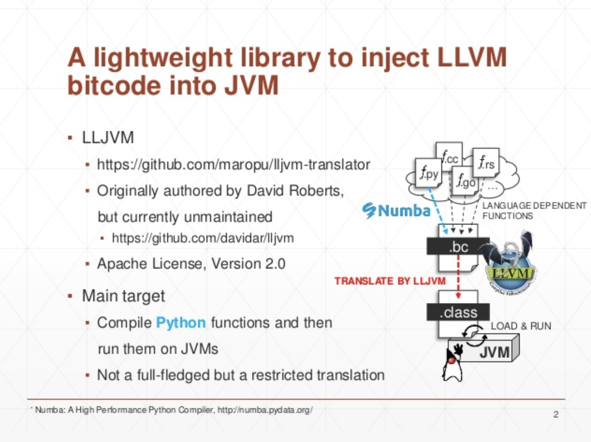

[](https://github.com/maropu/lljvm-translator/blob/master/LICENSE)
[](https://travis-ci.org/maropu/lljvm-translator)
[](https://maven-badges.herokuapp.com/maven-central/io.github.maropu/lljvm-translator/)
<!-- [](https://coveralls.io/github/maropu/lljvm-translator?branch=master) -->

This is an experimental low-level translator from LLVM bitcode to JVM bytecode.
Since existing tools can generate LLVM bitcode from functions written in some languages
(e.g.,  [Numba](https://numba.pydata.org/) for Python, [Clang](https://clang.llvm.org/) for C/C++, [Julia](https://julialang.org/),
[Gollvm](https://go.googlesource.com/gollvm/) for Go, and [Weld](https://www.weld.rs/) for cross-library optimization),
it is useful to inject the bitcode into JVMs. An objective of this library is to provide not a full-fledge translator
but a restricted one for easily injecting these functions into JVMs.

[](https://www.slideshare.net/maropu0804/lljvm-llvm-bitcode-to-jvm-bytecode#2)

Note that the core component is refactored from [lljvm](https://github.com/davidar/lljvm) (credit should go to the original author).

## Python functions to JVM class methods

First, you need to install `Numba` to generate LLVM bitcode from python functions:

    $ pip install numba

You run code blow to get LLVM bitcode for a python function:

```python
import math

from numba import cfunc

def pyfunc(x, y):
  return math.log10(2 * x) + y

## Compiles the python function above and writes as LLVM bitcode
with open("pyfunc.bc", "wb") as out:
  f = cfunc("float64(float64, float64)")(pyfunc)
  out.write(f._library._final_module.as_bitcode())
```

Finally, you get a JVM class file for the python function `pyfunc`:

    $ ./bin/lljvm-translator ./pyfunc.bc

To check gen'd bytecode in the JVM class file, you can use `javap`:

    $ javap -c -s pyfunc.class

```java
public final class GeneratedClass {
  ...
  public static double _cfunc__ZN8__main__10pyfunc_241Edd(double, double);
    descriptor: (DD)D
    Code:
       0: dconst_0
       1: dstore        4
       3: dconst_0
       4: dstore        6
       6: dconst_0
       7: dstore        8
       9: dload_0
      10: ldc2_w        #26                 // double 2.0d
      13: dmul
      14: dstore        4
      16: dload         4
      18: invokestatic  #8                  // Method java/lang/Math.log10:(D)D
      21: dstore        6
      23: dload         6
      25: dload_2
      26: dadd
      27: dstore        8
      29: dload         8
      31: dreturn
}
```

You can load this gen'd class file via Java Runtime Reflection and run in JVMs:

```java
import io.github.maropu.lljvm.LLJVMClassLoader;
import io.github.maropu.lljvm.LLJVMUtils;

public class LLJVMTest {

  public static void main(String[] args) {
    try {
      /**
       * If you want to load a class from LLVM bitcode directly, you write a line below;
       * Class<?> clazz = LLJVMClassLoader.currentClassLoader.loadClassFromBitcodeFile("pyfunc.bc");
       */
      Class<?> clazz = LLJVMClassLoader.currentClassLoader.loadClassFromBytecodeFile("pyfunc.class");
      System.out.println(LLJVMUtils.invoke(clazz, 3, 6));
    } catch (Exception e) {
      e.printStackTrace();
    }
  }
}
```

## For C/C++ functions

You can use `clang` to get LLVM bitcode for C/C++ functions:

    $ cat cfunc.c
    #include <math.h>
    double cfunc(double a, double b) {
      return pow(3.0 * a, 2.0) + 4.0 * b;
    }

    $ clang -c -O2 -emit-llvm -o cfunc.bc cfunc.c
    $ ./bin/lljvm-translator ./cfunc.bc

Then, you dump gen'd bytecode:

    $ javap -c cfunc.class

```java
public final class GeneratedClass {
  ...
  public static double __Z5cfuncdd(double, double);
    descriptor: (DD)D
    Code:
       0: dconst_0
       1: dstore        4
       3: dconst_0
       4: dstore        6
       6: dconst_0
       7: dstore        8
       9: dconst_0
      10: dstore        10
      12: dload_0
      13: ldc2_w        #8                  // double 3.0d
      16: dmul
      17: dstore        4
      19: dload         4
      21: dload         4
      23: dmul
      24: dstore        6
      26: dload_2
      27: ldc2_w        #13                 // double 4.0d
      30: dmul
      31: dstore        8
      33: dload         6
      35: dload         8
      37: dadd
      38: dstore        10
      40: dload         10
      42: dreturn
}
```

## For Julia functions

You can generate LLVM bitcode as follows;

    $ cat jlfunc.jl
    function jlfunc(a, b)
      return a * 2.0 + b
    end

    code_llvm(jlfunc, (Float64, Float64))

    $ julia jlfunc.jl > jlfunc.ll
    $ llvm-as jlfunc.ll
    $ ./bin/lljvm-translator ./jlfunc.bc

Then, you dump gen'd bytecode:

    $ javap -c jlfunc.class

```java
public final class GeneratedClass {
  ...
  public static double _julia_jlfunc_35021(double, double);
    Code:
       0: dconst_0
       1: dstore        4
       3: dconst_0
       4: dstore        6
       ...
       9: dload_0
      10: ldc2_w        #23                 // double 2.0d
      13: dmul
      14: dstore        4
      16: dload         4
      18: dload_2
      19: dadd
      20: dstore        6
      ...
      25: dload         6
      27: dreturn
}
```

## Array supports

Let's say that you have a function below;

    $ cat cfunc.c
    #include <stdio.h>
    long cfunc(long x[], int size) {
      long sum = 0;
      for (int i = 0; i < size; i++) {
        sum += x[i];
      }
      return sum;
    }

Then, you can handle the array in Java like;

```java
import io.github.maropu.lljvm.LLJVMClassLoader;
import io.github.maropu.lljvm.LLJVMUtils;
import io.github.maropu.lljvm.util.ArrayUtils;

long[] javaArray = {1L, 2L, 3L};
System.out.println(LLJVMUtils.invoke(clazz, ArrayUtils.addressOf(javaArray), javaArray.length));
```

## NumPy-aware translation and runtime

Most of python users possibly write functions with `NumPy`, so it is useful to translate them for JVMs.
Let's say that you write a function below with `NumPy` and
you get [LLVM assembly code](./examples/numpy_logistic_regression.ll) for the function via `Numba`:

```python
import numpy as np

def numpy_logistic_regression(Y, X, w, iterations):
  for i in range(iterations):
    w -= np.dot(((1.0 / (1.0 + np.exp(-Y * np.dot(X, w))) - 1.0) * Y), X)
    return w
```

Then, you invoke the bitcode of the function as follows:

```java
// Placeholders for Python arrays
PyArrayHolder Y = new PyArrayHolder();
PyArrayHolder X = new PyArrayHolder();
PyArrayHolder w = new PyArrayHolder();

// Loads LLVM bitcode and runs it
Class<?> clazz = LLJVMClassLoader.currentClassLoader.loadClassFromBitcodeFile("numpy_logistic_regression.bc");

LLJVMUtils.invoke(
  clazz,
  Y.with(double[] { 1.0, 1.0 }).addr(),
  X.with(double[] { 1.0, 1.0, 1.0, 1.0 }).reshape(2, 2).addr(),
  w.with(double[] { 1.0, 1.0 }).addr(),
  1L);
```

## Gen'd bytecode verification

As described above, our objective is to provide not a full-fledge translator but a restricted one for functions written in other languages.
So, it is important to verify that gen'd bytecode is correct and supported before execution.
The library does so when loading it in `LLJVMClassLoader` and, if it detects illegal code, it throws `LLJVMException`;

```java
try {
  Class<?> clazz = LLJVMClassLoader.currentClassLoader.loadClassFromBitcodeFile("func.bc");
  ...
} catch (LLJVMException e) {
  // Writes fallback code here
  ...
}
```

## Prints generated code in a Python interactive shell

For debugging uses, you can use helper functions to print generated code in a Python interactive shell.
To print generated code for a Python function, you can follow directions bloew;

```
$ ./bin/python
Python 2.7.15 (default, Sep 12 2018, 20:19:07)
[GCC 4.2.1 Compatible Apple LLVM 9.0.0 (clang-900.0.39.2)] on darwin

     __   __      ___   ____  ___
    / /  / /  __ / / | / /  |/  /
   / /__/ /__/ // /| |/ / /|_/ /
  /____/____/\___/ |___/_/  /_/   version 0.2.0-EXPERIMENTAL

 LLJVM debugging helper functions imported:
  - NumPy version: 1.15.2
  - SciPy version: 1.1.0
  - Numba version: 0.40.0
  - LLVMLite version: 0.25.0
  - LLVM version: 7.0.1

>>> def add(a, b):
...   return a + b
...

// When generating code for a Python function, you need to explicitly specify types
// because Python is a dynamically typed language. Type names follow
// the Numba specification below:
// - https://numba.pydata.org/numba-doc/dev/reference/types.html#basic-types
>>> print_llvm(add, "int32(int32, int32)")
...
; Function Attrs: norecurse nounwind readnone
define i32 @"cfunc._ZN8__main__7add$241Eii"(i32 %.1, i32 %.2) local_unnamed_addr #1 {
entry:
  %.16.i = add i32 %.2, %.1
  ret i32 %.16.i
}

>>> print_jvm(add, "int32(int32, int32)")
...
.method public static _cfunc__ZN8__main__7add_242Eii(II)I
	iconst_0
	istore 2
begin_method:
	invokestatic io/github/maropu/lljvm/runtime/VMemory/createStackFrame()V
label2:
	iload_1 ; __2
	iload_0 ; __1
	iadd
	istore_2 ; __16_i
	invokestatic io/github/maropu/lljvm/runtime/VMemory/destroyStackFrame()V
	iload_2 ; __16_i
	ireturn
	.limit stack 16
	.limit locals 3
end_method:
.end method
```

## Some notes

 - Supports OpenJDK 8 (64bit) only
 - Bundles native binaries for Linux/x86_64 and Mac/x86_64
   - For Linux, it is built by clang++ v3.6.2 (w/ glibc v2.17 and libstdc++ v4.8.5) on AWS Linux AMI (ami-0ad99772)
   - For Mac, it is built by Apple clang++ v900.0.39.2 on macOS Sierra v10.12.1
 - LLVM v7.0.1 used internally

## Maven dependency

    <dependency>
      <groupId>io.github.maropu</groupId>
      <artifactId>lljvm-core</artifactId>
      <version>0.2.0-EXPERIMENTAL</version>
      <type>jar</type>
      <scope>compile</scope>
    </dependency>

## Example code about how-to-use

See [lljvm-example](https://github.com/maropu/lljvm-example).

## Builds a native binary for your platform

To comile it, you need to check requirements below;

 - gcc-c++ v4.8.0+ / clang++ v3.1.0+
 - cmake v3.4.3+
 - python v2.7+
 - zlib v1.2.3.4+
 - ncurses v5.7+

Then, you run lines below;

    $ git clone https://github.com/maropu/lljvm-translator.git
    $ cd lljvm-translator/lib/lljvm-native

    // Downloads/compiles LLVM, builds a native library based on the compiled LLVM,
    // and then copys the library into a proper location.
    //
    // Or, you can use the pre-built LLVM in http://releases.llvm.org/download.html#7.0.1;
    //  $ wget http://releases.llvm.org/7.0.1/clang+llvm-7.0.1-<your platform>.tar.xz
    //  $ tar xvf clang+llvm-7.0.1-<your platform>.tar.xz
    //  $ LLVM_DIR=`pwd`/clang+llvm-7.0.1-<your platform> CXX=clang++ ./waf configure
    //  $ ./waf -v
    $ ./build-lljvm.sh

    // Moves the root and builds jar with the binary above
    $ cd ../..
    $ ./build/mvn clean package
    $ ls target
    lljvm-core_0.2.0-EXPERIMENTAL-with-dependencies.jar
    lljvm-core_0.2.0-EXPERIMENTAL.jar
    ...

## Use cases: just-in-time compiles Python UDFs for PySpark

Python UDFs in [Apache Spark](https://spark.apache.org/) have well-known overheads and the recent work of
[Vectorized UDFs](https://issues.apache.org/jira/browse/SPARK-21190) in the community
significantly improves the performance. But, Python UDFs still incur
[large performance gaps](https://gist.github.com/maropu/9f995f65b1cb160865e79e14e5216320) against Scala UDFs.
If we could safely inject python UDFs into Spark gen'd code, we would make the Python UDF overheads close to zero.
Here is [a sample patch](https://github.com/apache/spark/compare/master...maropu:LLJVMSpike) and
a quick benchmark below shows that the injection could make it around 50x faster than
the performance of the Vectorized UDFs:


## TODO

 - Adds more platform-dependent binaries in `src/main/resources/native`
   - Uses docker images (e.g., [dockcross](https://github.com/dockcross/dockcross) and [dockbuidl](https://github.com/dockbuild/dockbuild)) to build binaries
   - Creates a script to test binaries except for Linux/x86_64 with qemu/chroot
 - Statically Links BSD libc++ for native binaries
 - Supports Python v3.x

## Bug reports

If you hit some bugs and requests, please leave some comments on [Issues](https://github.com/maropu/llvm-jdc/issues)
or Twitter([@maropu](http://twitter.com/#!/maropu)).

